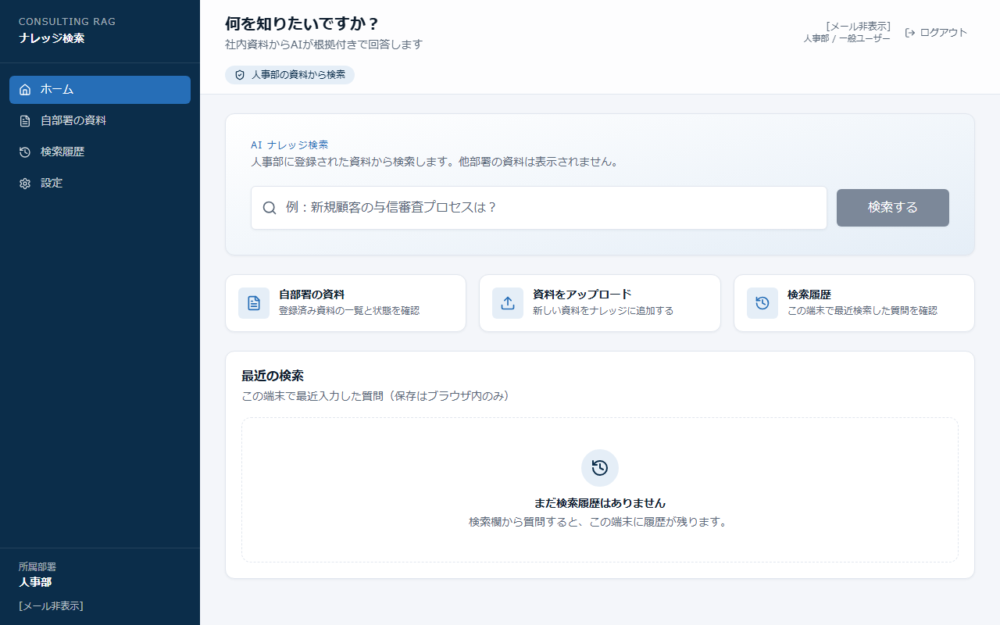
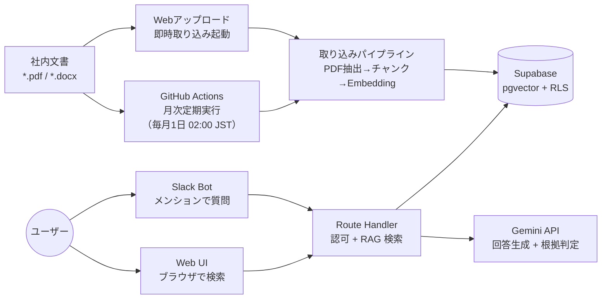

# Consulting RAG Knowledge System
**社内5,000件の文書を Slack・Web から自然言語で検索できる RAGボット**

> コンサルティング会社（従業員100名・6部署）向け。部署別アクセス制御・出典付き回答・ハルシネーション対策を実装した業務用 RAG システム。

**デモ：**  https://consulting-rag-knowledge-lp.vercel.app/

---

> 📌 **本ポートフォリオの前提について**
>
> 元となる模擬案件の提案書では **Vercel Pro・Supabase Pro** を想定しており、その場合 Vercel Cron による定期取り込みや Vercel 経由の大容量アップロードをシンプルに構成できます。
>
> 一方、本ポートフォリオ実装は**個人の無料開発環境（Vercel Hobby・Supabase 無料枠・Gemini API 無料枠）**で構築するという制約があるため、以下の差分があります。
>
> | 機能 | 提案書想定（有料プラン） | 本実装（無料枠） | 実運用への影響 |
> |---|---|---|---|
> | 月次文書取り込みの定期実行 | Vercel Cron | **GitHub Actions Cron**（毎月1日 02:00 JST） | 精度・SLA への影響なし |
> | ファイルアップロード経路 | Vercel API 経由（最大 4.5 MB） | **ブラウザ → Supabase Storage 直接 PUT** | Hobby プランの上限を回避し、要件の 20 MB 対応を実現 |
> | LLM・Embedding | Claude API 等（有料契約） | **Gemini API 無料枠**（`gemini-3.5-flash-lite` / `gemini-embedding-001`） | `LLM_PROVIDER` 環境変数 1 つで切替可能な設計 |
>
> **実運用時（有料プラン移行時）の主な変更点（案）**
> - 定期取り込み：`.github/workflows/ingest.yml` を削除し `vercel.json` に `crons` 設定を追加（例：`"crons": [{ "path": "/api/cron/ingest", "schedule": "0 17 1 * *" }]`）
> - アップロード経路：Storage 直接 PUT は本番でもそのまま使用可（変更不要）
> - LLM 切り替え：`LLM_PROVIDER` 環境変数を変更するだけでアプリコードの修正は不要

---

## このシステムが解決すること

**Before（導入前）**
- 1件の情報を探すのに30分：5,000件の文書をフォルダ構造で手探り
- 部署越境リスク：全社共有ドライブに営業・人事・戦略の機密文書が混在
- AI に聞くと「それっぽい嘘」：根拠なしの推測回答が実務判断に使えない

**After（導入後）**
- 自然言語で即検索：「昨年の銀行向けDX提案のROI試算は？」→ 該当セクションが返る
- 部署別RLS：URL直打ちでも他部署の文書は取得不可（DB＋サーバー二重防御）
- ハルシネーション対策：根拠不十分なら「見つかりませんでした」と正直に返す
- Slack 30秒SLA：Slackから質問→出典付き回答。遅延時は Web へ自動誘導

---

## 主な画面

| 一般ユーザー：検索結果 | 管理者：ダッシュボード |
|---|---|
|  |  |

| ユーザー管理 | 監査ログ |
|---|---|
|  |  |

---

## システム構成

---

## ドキュメント

**あなたの役割に合わせたドキュメントを確認してください**

| 役割 | こんな時に読む | ドキュメント |
|---|---|---|
| 開発担当者（セットアップ担当） | 初期構築・環境構築・認証情報管理・トラブル対応 | [セットアップ・運用ガバナンスガイド](docs/operation-guide.md) |
| RAG管理者（資料・ユーザー管理担当） | ユーザー追加・資料アップロード・監査ログ確認 | [セットアップ・運用ガバナンスガイド（Part 2）](docs/operation-guide.md#part-2rag管理者向け--日常運用) |
| 一般ユーザー（検索・アップロード） | 初回ログイン・Slack での質問・資料アップロード方法 | [操作手順書](docs/manual.md) |

---

## 技術スタック

| レイヤー | 技術 |
|---|---|
| フレームワーク | Next.js 14（App Router） |
| 言語 | TypeScript（strict） |
| DB・ベクトル検索 | Supabase（PostgreSQL + pgvector + RLS） |
| LLM | Google Gemini API（`gemini-3.5-flash-lite`）※2.5系廃止のため切替済み |
| Embedding | Gemini Embedding（`gemini-embedding-001`・768次元） |
| 定期実行 | GitHub Actions（月次 cron + Webアップロード後の即時起動） |
| Slack 連携 | Slack Bolt（署名検証・30秒SLA） |
| デプロイ | Vercel |

---

## セキュリティ設計のポイント

- **RLS＋サーバー側認可の二重防御**：Route Handler の認可チェックと Supabase RLS の両方をパスした場合のみデータを返す
- **ハルシネーション2段判定**：ベクトル類似度でまず候補を絞り、さらに AI 側が「参考文書に明示的な根拠があるか」を判定。根拠不十分なら回答しない
- **サービスロールキーの厳格分離**：`SUPABASE_SERVICE_ROLE_KEY` はサーバーサイド専用。ブラウザには `anon key` のみ
- **Slack 署名検証**：Signing Secret で全リクエストを検証。検証失敗リクエストは処理しない
- **APIキーのマスキング**：ログ・エラーメッセージへの機密情報混入を `maskSecrets()` で防止

---

## 注意事項

本プロジェクトは架空のコンサルティング会社を想定した学習・ポートフォリオ用プロジェクトです。
Supabase・Gemini API・GitHub Actions のテスト環境はすべて個人の無料枠を使用しています。

- **テストスクリプト（`scripts/`）について：** テストユーティリティに `@case7.local` ドメインのメールアドレスが定数として含まれています。これはテスト環境専用の架空ドメインです。
- **`testdocs/` について：** ディレクトリ構造は含まれていますが、テスト用 PDF/Word ファイルは本リポジトリには含まれていません。取り込みパイプラインを動作確認する場合は、このディレクトリに PDF または Word（.docx）ファイルを配置してください。

---

## 開発者

- **usako-ui**
- [ポートフォリオ](https://misako-profile-portfolio.vercel.app/)
- [業務相談（LINE公式）](https://line.me/R/ti/p/@745jejoa)

## ライセンス

**許可：** コードの閲覧・参照・学習目的での利用
**禁止：** 商用利用・無断複製/再配布・本コードをベースにした製品/サービス開発

商用利用・導入検討は [LINE公式アカウント](https://line.me/R/ti/p/@745jejoa) までご相談ください。
