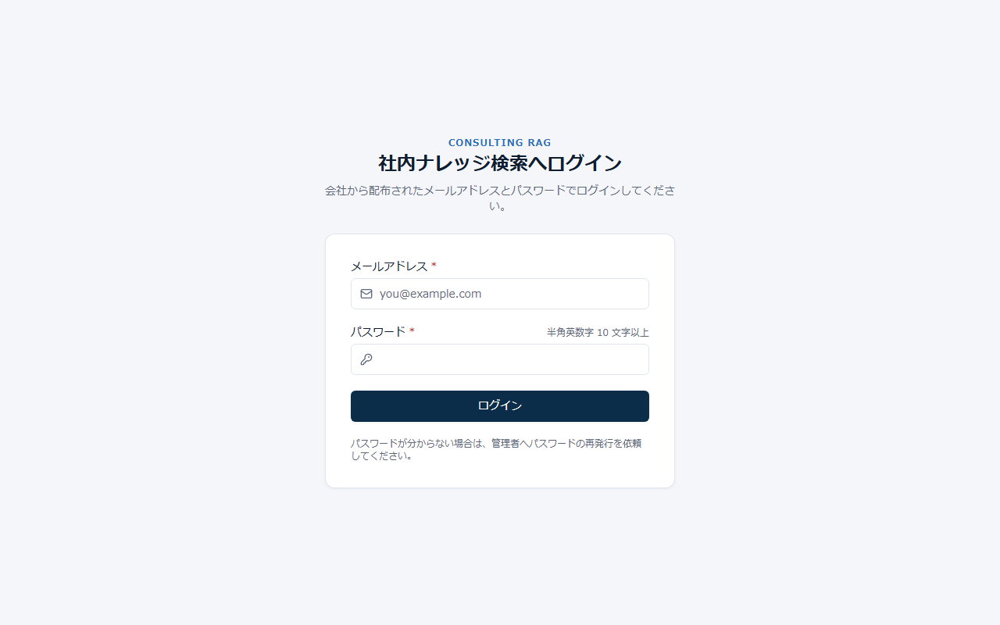
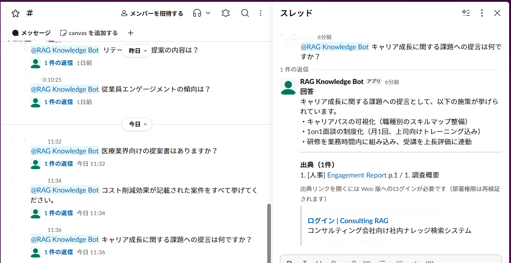
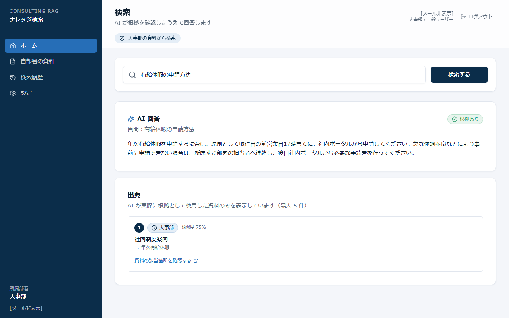
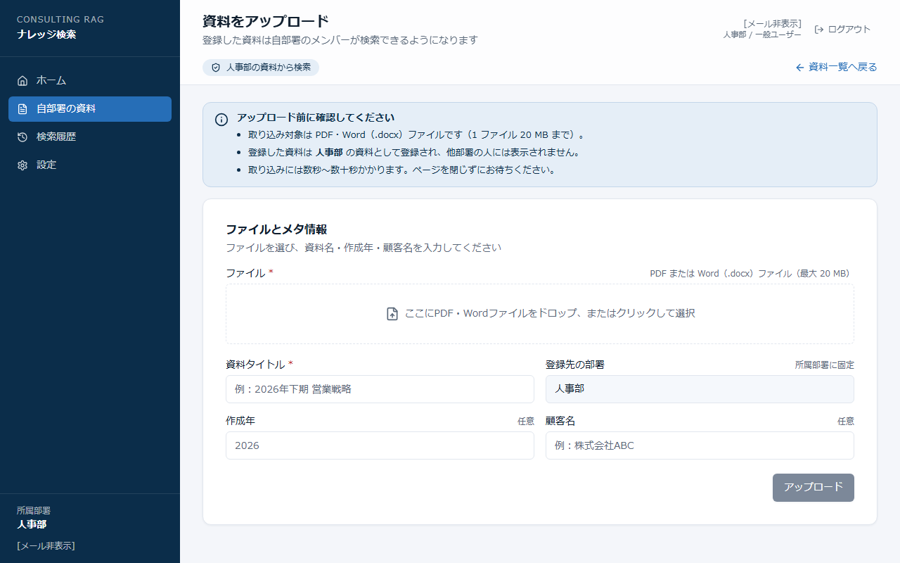
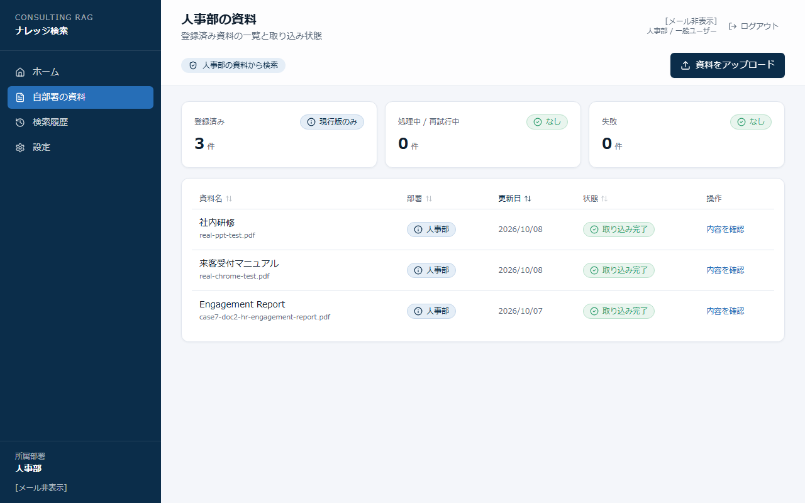

# 操作手順書｜RAGナレッジ検索 + Slackボット

**このマニュアルは一般ユーザー（検索・資料アップロードをする方）向けです。**
初回ログイン・Slackでの質問・資料アップロード・エラー時の対応方法をまとめています。印刷して手元に置いておくと便利です。

> ユーザー登録・パスワードリセットは管理者に依頼してください。管理者向けの詳細は [セットアップ・運用ガバナンスガイド](operation-guide.md) を参照。

---

## 1. 初回ログイン

| 何をする | どう操作する | どうなればOKか |
|---|---|---|
| サイトを開く | 管理者から受け取ったURLをブラウザで開く | ログイン画面が表示される |
| ログインする | メールアドレスと仮パスワードを入力して「ログイン」を押す | パスワード変更画面に切り替わる |
| パスワードを変更する | 新しいパスワードを2回入力して「変更」を押す | ホーム画面が表示される |

> **パスワードを忘れた場合：** 自分でリセットはできない。管理者に「パスワードリセット」を依頼する。

**2回目以降のログイン：**

| 何をする | どう操作する | どうなればOKか |
|---|---|---|
| ログインする | メールアドレスと自分で設定したパスワードを入力して「ログイン」 | ホーム画面が表示される |

---

## 2. Slackで質問する

| 何をする | どう操作する | どうなればOKか |
|---|---|---|
| チャンネルを開く | Slackで検索ボットが参加しているチャンネルを開く | チャンネルのメッセージ欄が表示される |
| 質問を送る | `@ボット名 有給休暇の申請方法を教えて` のようにメンションして送信する | 「検索中...」のメッセージが届く |
| 回答を受け取る | 数秒〜30秒以内に待つ | 出典付きの回答メッセージが届く |
| 元の資料を確認する（任意） | 回答内の出典リンクをクリックする | Webサイトで該当ページが開く（ログインが必要） |

> **30秒以上かかる場合：** 「Webサイトでも確認できます」という案内が届く。リンクをクリックしてWebサイトから検索する。

---

## 3. Webサイトで検索する

| 何をする | どう操作する | どうなればOKか |
|---|---|---|
| 検索欄に入力する | ログイン後、ホーム画面上部の検索欄に質問を入力する | 検索欄に文字が入力できる |
| 検索を実行する | 「検索」ボタンを押す（または Enterキー） | AIの回答と出典カードが表示される |
| 資料の詳細を確認する（任意） | 出典カードをクリックする | その資料の該当ページが開く |

> **「該当する情報が見つかりませんでした」と表示される場合：** 自部署の資料にその情報が含まれていない可能性がある。管理者に資料のアップロードを依頼する。

---

## 4. 資料をアップロードする

**対応ファイル：PDF・Word（.docx）のみ ／ 最大サイズ：1ファイルあたり20MB**

| 何をする | どう操作する | どうなればOKか |
|---|---|---|
| アップロード画面を開く | 左メニューの「自部署の資料」→ 右上の「資料をアップロード」ボタン | アップロード画面が表示される |
| ファイルを選ぶ | ファイルをドラッグ＆ドロップするか、画面をクリックしてファイルを選ぶ | ファイル名が画面に表示される |
| アップロードする | 「アップロード」ボタンを押す | 「アップロードが完了しました」と表示される |

> **アップロード後すぐには検索できない。** 処理が完了するまで最大で数分〜数十分かかる。「5. 取り込み状況を確認する」を参照。

**よくある画面メッセージ（アップロード時）：**

| 画面メッセージ（例） | 原因 | 対処 |
|---|---|---|
| 対応していないファイル形式です | PDF・Word以外のファイル | PDF または Word（.docx）に変換してから再試行 |
| ファイルサイズが上限を超えています | 20MBを超えている | ファイルを分割するか、圧縮して再試行 |
| 同じ内容の資料が既に登録されていました（重複登録は防止されました） | 同じ内容のファイルをアップロードしようとした | 内容が変わっていない場合は再アップロード不要。内容を変更した場合は再アップロードする |

---

## 5. 取り込み状況を確認する

| 何をする | どう操作する | どうなればOKか |
|---|---|---|
| 資料一覧を開く | 左メニューから資料一覧画面を選ぶ | 資料の一覧と状態バッジが表示される |

**状態の見方：**

| 状態バッジ | 意味 | 対処 |
|---|---|---|
| **待機中** | 処理の順番を待っている | そのまま待つ |
| **処理中** | AIがファイルを読み込んでいる最中 | そのまま待つ |
| **完了** | 検索できるようになった | 検索を試す |
| **再試行中** | 一時的なエラーで自動再処理中（最大3回） | そのまま待つ |
| **失敗** | 3回試みても処理できなかった | 下記「失敗した場合の対処」を参照 |

**失敗した場合の対処：**

| 状況 | 対処 |
|---|---|
| 新しくアップロードしたファイルが失敗した | 同じファイルを再度アップロードすると、再び処理が始まる |
| 過去に取り込み済みの内容を再登録しようとした | 内容が同じファイルは重複とみなされ、処理がスキップされる。ファイルの内容を更新してから再アップロードするか、管理者に再取り込みを依頼する |
| 再アップロードしても失敗が続く | 管理者に連絡する（ファイル名・エラーが出た日時を伝える） |

---

## 6. 出典の見方

検索結果に表示される「出典カード」の読み方：

| 表示項目 | 意味 |
|---|---|
| 資料名 | 回答の根拠になった資料のファイル名 |
| ページ番号 | 根拠となった情報が含まれているページ |
| セクション名（表示される場合） | ページ内の該当セクション |
| リンク | クリックすると元の資料の該当ページが開く（ログインが必要） |

- 出典カードは最大5件表示される
- 複数の資料にまたがる回答の場合、複数の出典カードが表示される
- 出典カードが0件のとき：「該当する情報が見つかりませんでした」と表示される（推測回答はしない）

---

## 7. 困った時の早見表

| 困りごと | まず自分で確認すること | 管理者に連絡するときに伝えること |
|---|---|---|
| ログインできない | メールアドレスとパスワードが正しいか確認する | 自分のメールアドレス・「○回試しても入れない」 |
| 回答が出ない・「見つかりません」と出る | 自部署の資料が登録されているか「資料一覧」で確認する | どんな質問をしたか・何の資料が必要か |
| アップロードが失敗する | ファイルがPDF・Word形式か、20MB以内か確認して再試行する | ファイルの形式・サイズ・エラーメッセージの内容 |
| 取り込みが「失敗」のままになっている（新しいファイル） | 同じファイルを再度アップロードしてみる | ファイル名・いつからその状態か |
| 取り込みが「完了」にならない（過去に登録済みのファイル） | 内容を変更していないファイルは重複のためスキップされる | ファイル名・登録済みかどうか |
| Slackでボットが無応答 | Webサイトから同じ検索をしてみる | いつから・どのチャンネルで起きているか |
| 出典リンクを開いたらエラーになった | ログインした状態で開いているか確認する | どの資料のリンクか・ブラウザのエラー内容 |

---

*※印刷が必要な場合は、PDFに出力してご利用ください*
