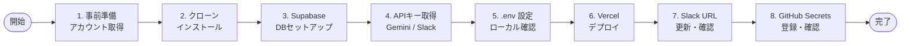
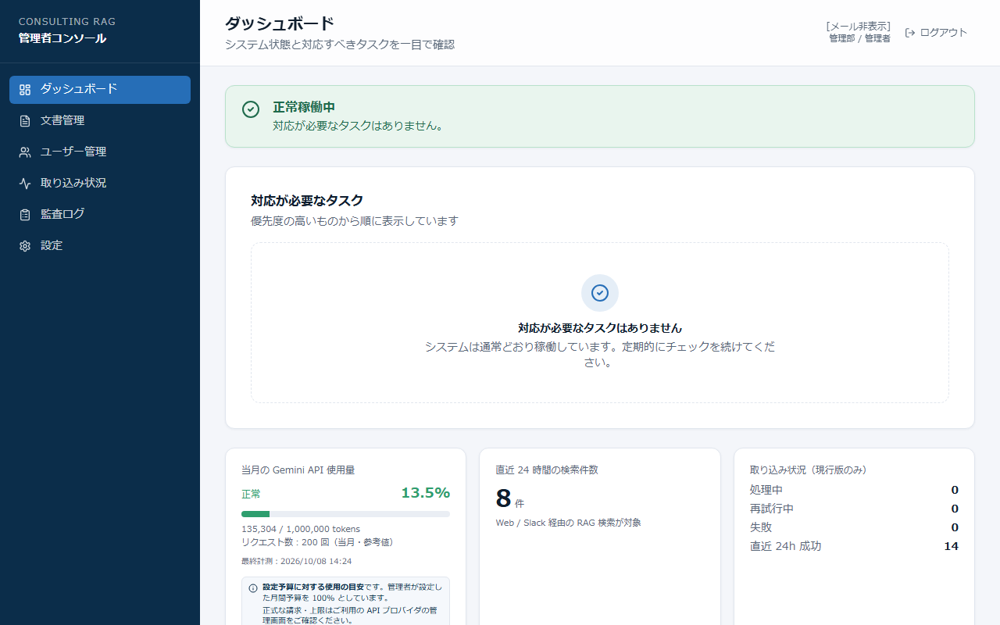
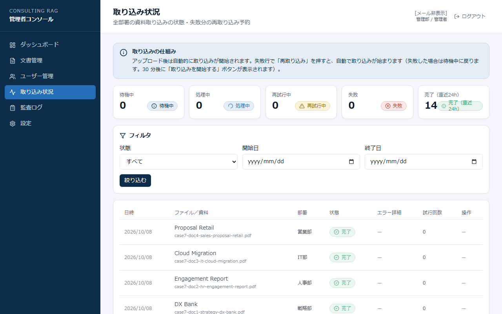
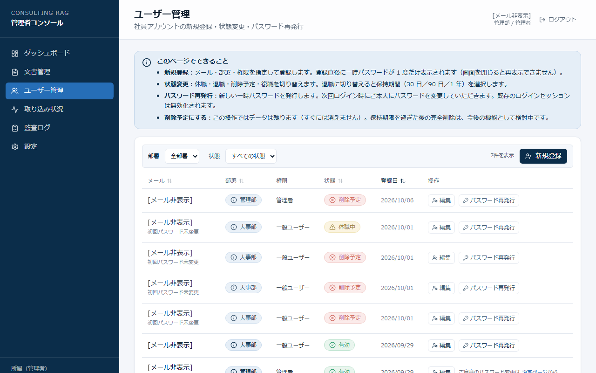
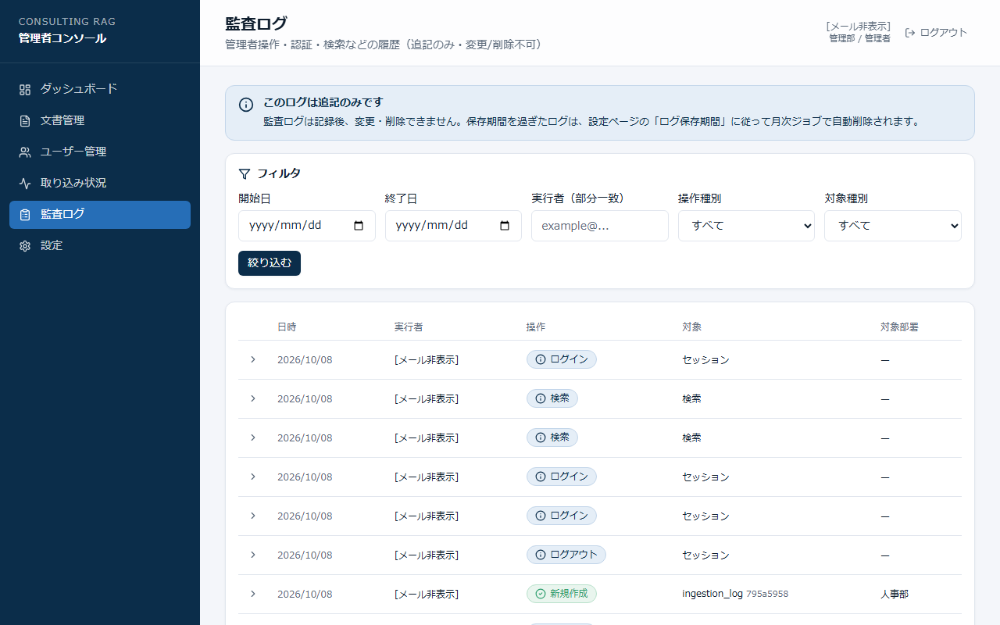

# セットアップ・運用ガバナンスガイド｜RAGナレッジ検索 + Slackボット

---

> ** 読む箇所の早見**
>
> | あなたの役割 | 読む箇所 |
> |---|---|
> | 開発担当者（初期セットアップ担当） | [Part 1](#part-1開発担当者向け--初期セットアップ) → [共通：認証情報管理・トラブル対応](#共通認証情報管理トラブル対応定期作業) |
> | RAG管理者（ユーザー・資料管理担当） | [Part 2](#part-2rag管理者向け--日常運用) → [共通：トラブル対応・定期作業](#共通認証情報管理トラブル対応定期作業) |
> | 一般ユーザー（検索・アップロード） | [操作手順書](manual.md) を参照（このガイドは対象外） |

---

## 目次

- [Part 1：開発担当者向け — 初期セットアップ](#part-1開発担当者向け--初期セットアップ)
- [Part 2：RAG管理者向け — 日常運用](#part-2rag管理者向け--日常運用)
- [共通：認証情報管理・トラブル対応・定期作業](#共通認証情報管理トラブル対応定期作業)
- [このガイドで対応できる範囲 / 開発担当者への依頼が必要な範囲](#このガイドで対応できる範囲--開発担当者への依頼が必要な範囲)
- [未対応の機能（Phase 2候補）](#未対応の機能phase-2候補)
- [既知の動作仕様・制約](#既知の動作仕様制約)
- [用語集](#用語集)
- [実施記録テンプレート（機密資料 物理削除）](#実施記録テンプレート機密資料-物理削除)
- [月次点検チェックリスト](#月次点検チェックリスト)

---

## Part 1：開発担当者向け — 初期セットアップ

### セットアップ全体の流れ



---

### 1. 事前に用意するもの

| 必要なもの | 取得先 | 備考 |
|---|---|---|
| GitHubアカウント | github.com | リポジトリをクローンするため |
| Supabaseアカウント | supabase.com | 無料プランで可 |
| Google AI Studioアカウント | aistudio.google.com | Gemini APIキー取得のため |
| Slackワークスペース管理者権限 | — | Slack App を作成するため |
| Vercelアカウント | vercel.com | デプロイ先 |
| Node.js v22以上 | nodejs.org | ローカル動作確認用 |

---

### 2. リポジトリのクローンと依存インストール

```bash
git clone https://github.com/usako-ui/consulting-rag-knowledge-system-dev.git
cd consulting-rag-knowledge-system-dev
npm install
cp .env.example .env
```

`.env` は次のステップで取得したキーを記入していきます。

---

### 3. Supabaseプロジェクトの作成とDBセットアップ

**必ず新規プロジェクトを作成する（他案件・他システムと共用しないこと）**

1. Supabase Dashboard（supabase.com）で「New project」を作成
2. **Project Settings → API** から以下をメモ：

| 項目 | 使用する環境変数 |
|---|---|
| Project URL | `NEXT_PUBLIC_SUPABASE_URL` / `SUPABASE_URL` |
| anon public key | `NEXT_PUBLIC_SUPABASE_ANON_KEY` |
| service_role key | `SUPABASE_SERVICE_ROLE_KEY` ⚠️ 外部共有・コードへの直書き禁止 |

3. **SQL Editor** でマイグレーションを**番号順に全件**実行：

```
supabase/migrations/
  20260928000001_init_extensions_and_enums.sql
  20260928000002_create_tables.sql
  20260928000003_rls_policies.sql
  20260928000004_harden_security_definer_functions.sql
  20260930000001_audit_log_immutable.sql
  20260930000002_system_settings_api_budget.sql
  20260930000003_system_settings_write_service_role_only.sql
  20261007000001_add_search_failed_audit_action.sql
  20261007000002_add_storage_columns.sql
  20261007000003_ingestion_log_content_hash.sql
  20261007000004_storage_rls.sql
  20261008000001_add_dispatch_failed_audit_action.sql
```

各ファイルの内容を SQL Editor にコピー＆ペーストして「Run」を押してください。**上から順に1ファイルずつ実行してください。**

---

### 3.5. 初期管理者アカウントの作成（初回のみ）

管理画面のユーザー登録機能はログイン済みの管理者が必要なため、最初の管理者は Supabase Dashboard から手動作成します。

> **要確認：** 以下はコードとDBスキーマから推定した手順です。実行前に動作を確認してください。

1. Supabase Dashboard → **Authentication → Users → Add user** → メールアドレスとパスワードを入力して作成
2. 作成されたユーザーの **UUID** をコピー（ユーザー行をクリックして表示）
3. **SQL Editor** で以下を実行：

```sql
INSERT INTO public.user_profiles (id, email, department, role, password_changed)
VALUES (
  '（コピーした UUID）',
  '（メールアドレス）',
  'management',  -- 適切な部署に変更可
  'admin',
  false          -- false にすると初回ログイン時にパスワード変更を求める
);
```

4. 設定したメールアドレスとパスワードで Webアプリにログインし、管理画面が表示されることを確認

> **注意：** SQL Editor は postgres ロールで実行されRLSをバイパスします。本手順は初期セットアップのみ。以降のユーザー追加は管理画面から行ってください。

---

### 4. Gemini APIキーの取得

1. Google AI Studio（aistudio.google.com）にアクセス
2. 左メニュー「APIキー」→「APIキーを作成」
3. 取得したキーを `.env` の `GEMINI_API_KEY` に記入

---

### 5. Slack Appの作成と設定

1. https://api.slack.com/apps にアクセスし「Create New App」→「From scratch」
2. **OAuth & Permissions** でスコープを追加：

| スコープ | 用途 |
|---|---|
| `app_mentions:read` | メンションを受け取る |
| `chat:write` | 返答を送信する |
| `users:read` | ユーザー情報を取得する |
| `users:read.email` | ユーザーのメールアドレスを取得する |

3. 「Install to Workspace」→ 表示される **Bot User OAuth Token** をメモ（`SLACK_BOT_TOKEN`）
4. **Basic Information → App Credentials** から **Signing Secret** をメモ（`SLACK_SIGNING_SECRET`）

---

### 6. .envの設定（ローカル確認用）

`.env` に以下を記入します（`.env.example` に全項目の説明があります）：

```env
NEXT_PUBLIC_SUPABASE_URL=（Supabase Project URL）
NEXT_PUBLIC_SUPABASE_ANON_KEY=（Supabase anon key）
SUPABASE_URL=（Supabase Project URL）
SUPABASE_SERVICE_ROLE_KEY=（Supabase service_role key）
GEMINI_API_KEY=（Gemini APIキー）
SLACK_BOT_TOKEN=（Slack Bot User OAuth Token）
SLACK_SIGNING_SECRET=（Slack Signing Secret）
WEB_APP_URL=（VercelデプロイURL。ローカル確認時は http://localhost:3000）
```

> `.env` ファイルは Git にコミットしない（`.gitignore` で除外済み）。誤ってコミットした場合はキーを即時無効化してください。

ローカル動作確認：

```bash
npm run dev
# http://localhost:3000 でアクセス確認
```

---

### 7. Vercelへのデプロイと環境変数設定

1. Vercel（vercel.com）で「New Project」→ GitHub リポジトリを選択してデプロイ
2. デプロイ完了後、**Project Settings → Environment Variables** に `.env` の全項目を登録
3. 再デプロイ（Redeploy）を実行して環境変数を反映

---

### 8. Slack EventsのリクエストURL更新

Vercel の URL が確定したら実施：

1. Slack API → 対象アプリ → **Event Subscriptions**
2. Request URL に `https://（VercelのURL）/api/slack/events` を入力
3. URL検証が通ることを確認（「Verified」と表示される）
4. 「Subscribe to bot events」で `app_mention` を追加して保存
5. Slack のチャンネルにボットを招待：`/invite @（ボット名）`

---

### 9. GitHub Secretsの設定

**用途：Webアップロード後の自動取り込み起動・管理者による手動起動に使用します。**
月次 cron はスケジュール自動実行のため PAT は不要ですが、アップロード直後の即時処理には以下の登録が必要です。

**場所：** GitHubリポジトリ → Settings → Secrets and variables → Actions → New repository secret

| Secret名 | 値 | 備考 |
|---|---|---|
| `SUPABASE_URL` | Supabase Project URL | — |
| `SUPABASE_SERVICE_ROLE_KEY` | Supabase service_role key | — |
| `GEMINI_API_KEY` | Gemini APIキー | — |
| `GITHUB_DISPATCH_TOKEN` | GitHub Fine-grained Personal Access Token | **30日で自動失効。期限切れになるとWebアップロード後に「待機中」のまま処理が始まらなくなる** |

GitHub PAT（個人アクセストークン）の発行：GitHub → Settings → Developer settings → Personal access tokens → Fine-grained tokens
- 対象リポジトリ限定
- 権限：Actions（Read & Write）のみ

---

### 10. 動作確認チェックリスト

| # | 確認項目 | OKの目安 |
|---|---|---|
| 1 | VercelのURLにアクセスできる | ログイン画面が表示される |
| 2 | 管理者アカウントでログインできる | ダッシュボードが表示される |
| 3 | ダッシュボードにエラーバナーが出ていない | 正常状態になっている |
| 4 | テスト資料をアップロードして「完了」になる | 資料一覧に「完了」バッジが表示される |
| 5 | 検索して出典付きの回答が返る | 回答カードと出典カードが表示される |
| 6 | Slackで `@ボット名 テスト` と送って回答が返る | 30秒以内に返答が届く |
| 7 | GitHub Actions が正常に実行できる | Actions → `ingest.yml` が緑になる |

---

## Part 2：RAG管理者向け — 日常運用

> RAG管理者は開発担当者と必ずしも同一ではありません。このパートはセットアップ完了後のシステムを日常管理する担当者向けです。



---

### 資料を追加する

**対応ファイル：PDF・Word（.docx）のみ ／ 最大サイズ：1ファイル20MB**

1. 左メニュー「自部署の資料」→ 右上「資料をアップロード」ボタン
2. ファイルをドラッグ&ドロップ（または画面をクリックして選択）
3. 「アップロード」を押す → 「アップロードが完了しました」を確認

アップロードを実行すると自動的に取り込みジョブが起動します。取り込み完了まで数分〜数十分かかる場合があります。

---

### 取り込み状況を確認する



| 状態バッジ | 意味 | 対処 |
|---|---|---|
| **待機中** | 処理の順番待ち | そのまま待つ。10分以上続く場合は「再取り込み」ボタンを押す |
| **処理中** | AIがファイルを読み込み中 | そのまま待つ |
| **完了** | 検索対象に追加された | 検索で出るか確認する |
| **再試行中** | 一時エラーで自動再処理中（最大3回） | そのまま待つ |
| **失敗** | 3回試みても処理できなかった | 下記「失敗した資料の再取り込み」を参照 |

---

### 失敗した資料を再取り込みする

原因によって対処が異なります：

| 状況 | 対処方法 |
|---|---|
| **一度も取り込みが成功していない**（新規ファイルの失敗） | 同じファイルを再アップロードすると新しい取り込みが始まる |
| **過去に取り込み済みの内容を再登録しようとした**（内容変更なし） | 重複防止機能により処理がスキップされる。内容を変更してから再アップロードする |
| **管理者権限で再試行したい** | 取り込み状況画面の「再取り込み」ボタンを押す（管理者専用） |

> 原因不明の失敗が続く場合は開発担当者に連絡し、エラー詳細の確認を依頼してください。

---

### 資料を削除する

削除後は**検索対象から外れる**。DB上の記録（ファイル情報・監査ログ）は残る。

1. 資料管理画面 → 対象資料の「削除」ボタン
2. 確認ダイアログ → 「削除する」を押す
3. 状態が「無効（非表示）」になれば完了

> **機密文書を誤って登録した場合：** 削除直後から検索対象外になります。ただし DB 上のデータが完全に消えるわけではありません（論理削除）。完全削除が必要な場合は開発担当者に依頼してください。

---

### 機密資料を誤って登録した場合の対応

機密情報が含まれるファイルを誤ってアップロードした場合は、次の3段階で対応します。

---

#### ① 即時対応（RAG管理者が実施）

| 手順 | 操作 | 完了の目安 |
|---|---|---|
| 1. 即時停止 | 資料管理画面 → 対象資料の「削除」ボタン → 確認ダイアログで「削除する」 | 状態が「非表示（無効）」になる |
| 2. 開発担当者に報告 | 資料名・アップロード日時・誰が検索した可能性があるか | 開発担当者への連絡 |

論理削除（`is_active = false`）により、操作直後から検索対象外になります。DBには記録が残ります。

> **「機密扱いへの変更」は未対応：** 資料の部署変更は実装されていないため、部署変更による閲覧制限の絞り込みはできません（なお、ユーザーの部署変更は別機能として実装済みです）。また管理者は部署に関係なく全資料を閲覧できるため、仮に部署変更ができたとしても管理者からは隠せません。現時点での即時対応は論理削除（①）のみです。

---

#### ② 根本対応（開発担当者が実施）— 手動 SQL での物理削除

> **⚠️ Supabase SQL Editor は本番 DB に直接接続します。実行前に必ず対象行を SELECT し、その結果を手元にコピーして控えを取ってから DELETE を実行してください。**

**テーブルの依存関係（削除順序の根拠）：**

| テーブル | documents との関係 | documents 削除時の挙動 |
|---|---|---|
| `document_chunks` | `document_id` → `documents.id`（ON DELETE CASCADE） | documents 削除で自動削除 |
| `ingestion_log` | `document_id` → `documents.id`（ON DELETE SET NULL） | `document_id` が null になるが行は残る。`file_id` / `title` / `department` / `client_name` / `storage_path` / `content_hash` 列も残る |
| Storage 元ファイル | `documents.storage_path` で参照 | DB 削除では消えない。別途 Storage から削除が必要 |

> ⚠️ **初めてこの手順を行う場合は、まず削除しても支障のないダミー資料で Step 1〜5 全体を一度通してください。**

**Step 1：対象を特定して1件のみであることを確認する**

タイトルで対象を検索し、document_id（UUID）を確認します。

```sql
-- 対象資料をタイトルで検索。結果を手元にコピーしてから次へ進む
SELECT
    d.id            AS document_id,
    d.title,
    d.department,
    d.file_id,
    d.storage_path,
    d.is_active,
    d.created_at,
    COUNT(c.id)     AS chunk_count
FROM public.documents d
LEFT JOIN public.document_chunks c ON c.document_id = d.id
WHERE d.title = '（対象資料のタイトル）'
GROUP BY d.id;
```

> **結果が1件であることを必ず確認してから Step 2 へ進んでください。**
> - **0件** → タイトルが異なる可能性あり。`WHERE d.file_id = '（ファイル名）'` で再検索する
> - **2件以上** → 同名タイトルが複数存在する。`d.department` や `d.created_at` で絞り込み、削除対象の document_id（UUID）を1件に特定してから次へ進む

```sql
-- ingestion_log の対象行も確認・控えを取る
SELECT id, file_id, title, department, status, created_at, storage_path, content_hash
FROM public.ingestion_log
WHERE document_id = '（上で確認した document_id）'
   OR file_id = '（上で確認した file_id）';
```

**Step 2：documents を物理削除（document_chunks は CASCADE で自動削除）**

> **DELETE は必ず document_id（UUID）で行います。** タイトルやファイル名での DELETE は意図しない行が削除される危険があります。

```sql
-- Step 1 で確認した document_id（UUID）のみを WHERE 条件に使う
-- 例: WHERE id = 'xxxxxxxx-xxxx-xxxx-xxxx-xxxxxxxxxxxx'
DELETE FROM public.documents
WHERE id = '（Step 1 で確認した document_id）';
```

**Step 3：Storage 元ファイルを削除**

> **storage_path が null の場合はこの Step をスキップして Step 4 へ進んでください。**（GHA / testdocs 経由でのアップロードのため Storage にファイルは存在しません）

**storage_path の読み方：**

Step 1 の SELECT で控えた `storage_path` の値は `部署フォルダ/UUID形式のファイル名.拡張子` の形になっています。

```
例： hr/3f8a2c1d-4b7e-4f2a-9c0d-1e2f3a4b5c6d.pdf
     ↑部署フォルダ  ↑ファイル名（UUID形式。元のファイル名では保存されていません）
```

**操作手順：**

1. Supabase Dashboard にアクセスし、左メニューの **Storage** をクリック
2. バケット一覧から **`rag-documents`** を選択
3. `storage_path` の最初の `/` より前の文字列（部署フォルダ名）をクリックして開く
   - 例：`hr/3f8a2c1d-...` の場合は `hr` フォルダを開く
4. ファイル一覧から `storage_path` の `/` より後ろの部分と完全一致するファイルを探して選択する
   - 例：`3f8a2c1d-4b7e-4f2a-9c0d-1e2f3a4b5c6d.pdf`
   - ファイルを選択すると右側の詳細パネルにフルパスが表示されるので、**storage_path の値と全体一致していることを確認する**（要確認：詳細パネルの表示項目は Supabase の UI バージョンによって異なる場合があります）
5. 確認できたら **Delete（削除）** を実行する

> **注意：**
> - **フォルダごと削除しないこと。** 同一部署の他の資料ファイルがすべて消えます
> - ファイル名は UUID 形式のため元のファイル名では探せません。必ず `storage_path` の値をコピーして照合してください
> - 対象ファイルが見当たらない場合は、`storage_path` の値を再確認し、フォルダを間違えていないか確認してください

**Storage から消えたことを目視確認してから Step 4 へ進んでください。**
（フォルダを再度開いて対象ファイルが一覧に表示されなければ削除完了です）

**Step 4：ingestion_log に残った行を確認・対処**

```sql
-- documents 削除後、document_id が null になった行が残っていることを確認
SELECT id, file_id, title, department, status, document_id, created_at, content_hash
FROM public.ingestion_log
WHERE file_id = '（対象の file_id）';
```

ファイル名・タイトル等の記録を完全消去したい場合は以下を実行：

```sql
-- ingestion_log の残存行を削除（不要な場合はスキップ可）
DELETE FROM public.ingestion_log
WHERE file_id = '（対象の file_id）'
  AND document_id IS NULL;
```

**Step 5：削除完了を確認**

```sql
-- どちらも 0 件であれば削除完了
SELECT COUNT(*) FROM public.documents      WHERE id          = '（対象の document_id）';
SELECT COUNT(*) FROM public.document_chunks WHERE document_id = '（対象の document_id）';
```

---

#### ③ 事後確認（管理者・開発担当者が実施）

**監査ログで参照履歴を確認する**

管理者ダッシュボード → 監査ログ → 操作種別「検索」で対象期間を絞り込み、当該資料が検索された可能性のある操作を確認します。

> **redact（伏せ字化）対象なし：** 検索の監査ログには質問文の先頭50文字・ヒット件数の数値のみが記録されます。チャンクID・資料IDは記録されていないため、個別のログ行を伏せ字化する必要はありません。
>
> **注意：** 質問文の先頭50文字に機密情報が含まれる場合の対処は未対応です（監査ログは改ざん不可のため、API・管理画面からログ上の文字列を変更できません）。この場合は開発担当者に相談してください。

**Slack上の回答を削除する**

ボットの回答メッセージには以下の内容が含まれており、DB削除とは無関係に**Slack上に永続的に残ります**：

| Slackに残る内容 | 詳細 |
|---|---|
| **回答本文** | AIが生成した回答テキスト。機密情報が回答文中に含まれた場合もそのまま残る |
| **出典リスト** | 資料タイトル・ページ番号・セクション名（最大5件） |
| **出典URL** | Web版の該当ページへのリンク |

**機密情報が回答本文や資料タイトルとして表示されていた場合は、Slack上のメッセージ削除も必須です。**

> **出典URLのリスクキャンセル：** DB削除後は残ったURLをクリックしてもログインが必要でアクセス不可になります（RLSによる保護）。ただし、資料タイトルや回答本文自体は削除しないと残り続けます。

Slack上のボット投稿を削除する手順：

1. 対象メッセージにマウスを合わせる → 右上の「…（その他の操作）」をクリック
2. 「メッセージを削除」を選択
3. 確認ダイアログで削除を実行

> **削除できる権限はワークスペース設定によります（要確認）。** 一般的にはワークスペースオーナーまたは管理者が他ユーザー・ボットの投稿を削除できますが、設定によって異なります。削除権限がない場合はワークスペース管理者に依頼してください。

> Slack上のメッセージ自動削除ツールは実装されていません（Phase 2候補）。削除件数が多い場合はワークスペース管理者に相談してください。

---

### ユーザーを登録する



1. 「ユーザー管理」→「新規ユーザー登録」
2. メールアドレス・部署・ロール（一般 / 管理者）を入力して「登録」
3. 表示される仮パスワードをメモして本人に直接伝える

> **この画面を閉じると仮パスワードは再確認不可。** 必ずメモしてから閉じてください。

---

### ユーザーの状態・部署を変更する

| 状態 | 使うタイミング | ログイン可否 |
|---|---|---|
| **有効** | 通常利用中 | 可 |
| **一時停止（休職等）** | 一時的な利用停止 | 不可（復帰時に「有効」に戻す） |
| **一時停止（退職処理中）** | 退職・引き継ぎ中 | 不可（データ保持） |

**部署変更の注意：** 部署を変更すると、変更後は新しい部署の資料のみ検索できるようになります。変更前後の内容は監査ログに記録されます。

> 最後の管理者アカウントは停止・降格できません。システムにログインできなくなります。

---

### パスワードをリセットする

1. 「ユーザー管理」→ 対象ユーザーの「リセット」ボタン
2. 表示される新しい仮パスワードをメモして本人に伝える

> **この画面を閉じると仮パスワードは再確認不可。**

---

### 監査ログを確認する



左メニュー「監査ログ」で操作履歴を確認できます。日付・操作者・操作種別でフィルター可能。

**確認できる操作種別：**

| 操作種別 | 記録される内容 |
|---|---|
| 資料の登録・更新・削除 | ファイル名・部署・実行者 |
| **ユーザー操作（新規登録・状態変更・部署変更）** | **変更前後の状態・部署が両方記録される** |
| 設定変更 | 変更前後の値 |
| ログイン・ログアウト | 実行者・日時 |
| **検索（質問内容）** | **質問文の先頭50文字のみ記録。全文は保存されない** |
| 検索失敗 | エラー種別・実行者 |

> 監査ログは書き込み後の変更・削除は不可（システムで制御済み）。

---

### 管理者の引き継ぎ

1. 「ユーザー管理」から新しい管理者アカウントを登録する（ロール：管理者）
2. 新管理者が初回ログイン・パスワード変更したことを確認する
3. 旧管理者アカウントを「一時停止（退職処理中）」に変更する
4. 認証情報の保管場所と更新手順を引き継ぐ（「共通：認証情報管理」を参照）

---

## 共通：認証情報管理・トラブル対応・定期作業

### 認証情報一覧とリスク

| 認証情報名 | 環境変数 | 漏洩した場合の影響 | 有効期限 |
|---|---|---|---|
| Supabase サービスキー | `SUPABASE_SERVICE_ROLE_KEY` | **全データの読み書き削除が可能。最も危険。** | 無期限 |
| Supabase anon key | `NEXT_PUBLIC_SUPABASE_ANON_KEY` | RLS（部署別アクセス制御）で保護済みのため直接被害は限定的 | 無期限 |
| Gemini APIキー | `GEMINI_API_KEY` | 第三者が無制限にAPIを使用可能 | 無期限 |
| Slack Bot Token | `SLACK_BOT_TOKEN` | ボットとして任意のメッセージ送信・読み取りが可能 | 無期限 |
| Slack Signing Secret | `SLACK_SIGNING_SECRET` | 偽リクエストをボットとして受け付けてしまう | 無期限 |
| GitHub PAT | `GITHUB_DISPATCH_TOKEN` | アップロード後の自動起動・管理者手動起動を外部から不正操作可能 | **30日で自動失効** |

---

### 漏洩時の緊急手順

```
1. 即時無効化：該当サービスのダッシュボードでキー/トークンを無効化・削除
2. 新しい値を発行：同じダッシュボードで再発行
3. 下の「更新先チェック表」で全箇所を更新
4. Vercel → Deployments → 最新のデプロイを「Redeploy（再デプロイ）」
5. Webアプリにアクセスし、ログイン・検索が正常に動くことを確認
6. 不正利用の確認（Supabase Logs / Gemini APIコンソール / Slack アクティビティ / GitHub Actions 履歴）
```

---

### 更新先チェック表（更新漏れ防止）

| 変数名 | Vercel 環境変数 | GitHub Secrets | ローカル `.env` |
|---|---|---|---|
| `SUPABASE_URL` / `NEXT_PUBLIC_SUPABASE_URL` | ✓ | ✓ | ✓ |
| `NEXT_PUBLIC_SUPABASE_ANON_KEY` | ✓ | — | ✓ |
| `SUPABASE_SERVICE_ROLE_KEY` | ✓ | ✓ | ✓ |
| `GEMINI_API_KEY` | ✓ | ✓ | ✓ |
| `SLACK_BOT_TOKEN` | ✓ | — | ✓ |
| `SLACK_SIGNING_SECRET` | ✓ | — | ✓ |
| `GITHUB_DISPATCH_TOKEN` | ✓ | ✓ | ✓ |

---

### トラブル早見表

| 症状 | まず確認すること | 対処 | 対応者 |
|---|---|---|---|
| Webアプリにアクセスできない | Vercelダッシュボードのデプロイ状態 | 失敗していれば「Redeploy（再デプロイ）」 | 開発担当者 |
| ログインできない（ユーザーから報告） | ユーザー管理でアカウントの状態を確認 | パスワードリセット or 状態変更（Part 2参照） | 管理者 |
| 検索して何も出ない（ユーザーから報告） | 取り込み状況で対象部署の資料状態を確認 | 「完了」の資料がなければアップロード依頼 | 管理者 |
| Slackボットが無応答 | ボットのチャンネル参加状況・Vercelエラーログ | Webアプリで代替。改善しなければ開発担当者へ | 開発担当者 |
| 管理画面に赤いバナーが出ている | バナーに記載の対処法 | 指示に従う。不明なら開発担当者へ | 管理者→開発担当者 |
| APIゲージが赤（100%以上） | ダッシュボードのゲージ | 予算を引き上げるか当月の利用を控える | 管理者 |
| 取り込みが「失敗」になる | 失敗の詳細メッセージ | 「失敗した資料の再取り込み」参照 | 管理者 |
| **アップロード後、ずっと「待機中」のまま動かない** | **GitHub Actions → `ingest.yml` の実行履歴を確認** | **403エラーが出ていれば GitHub PAT 期限切れ → §9 の手順で再発行・Redeploy** | **開発担当者** |
| GitHub Actionsが失敗する（403エラー） | Actions → 失敗ジョブのログ | `GITHUB_DISPATCH_TOKEN` 期限切れ → §9 の手順で再発行・全箇所を更新・Redeploy | 開発担当者 |

---

### よくあるエラーメッセージ

| エラーの場面 | メッセージ（例） | 原因と対処 |
|---|---|---|
| 検索時 | 「AIサービス側で一時的に利用制限がかかっています」 | Gemini APIの一時制限。数分後に再試行 |
| アップロード時 | 「ファイルの中身を読み取れませんでした」 | 壊れたファイルまたは画像のみのPDF。別のファイルで試す |
| アップロード時 | 「対応していないファイル形式です」 | PDF・Word以外のファイル。形式を確認して再試行 |
| アップロード時 | 「ファイルサイズが上限を超えています」 | 20MB超。ファイルを分割して再試行 |

---

### 定期作業

| 頻度 | 作業 | 確認場所 | 対処 | 対応者 |
|---|---|---|---|---|
| **毎月1日** | 取り込みジョブの自動実行確認 | GitHub → Actions → `ingest.yml` | 失敗していたらログ確認 → トラブル早見表参照 | 開発担当者 |
| **毎月** | APIゲージのリセット確認 | ダッシュボードのゲージ（月初に0%に戻る） | リセットされていなければ開発担当者へ | 管理者 |
| **30日ごと** | GitHub PAT の再発行 | GitHub → Fine-grained tokens → 有効期限を確認 | 再発行 → Vercel・GitHub Secrets・`.env` を更新 → Redeploy。**PAT を発行したら必ず「発行日+30日」を手帳・カレンダーに控え、前日にアラートを設定する。失効するとWebアップロード後に「待機中」のまま動かなくなる。管理者の取り込み状況画面で30分超過後に「取り込みを開始する」ボタンが表示されるが、PAT失効時はこのボタンも「取り込みの起動に失敗しました」エラーになる（根本解決は PAT 再発行のみ）** | 開発担当者 |
| **必要時** | 「削除待ち」ユーザーの保持期限確認 | ユーザー管理画面 | 期限到来後は開発担当者に完全削除を依頼 | 管理者→開発担当者 |

---

### このガイドで対応できる範囲 / 開発担当者への依頼が必要な範囲

| 状況 | 対応者 | 手順・場所 |
|---|---|---|
| ログインできない（パスワード忘れ） | RAG管理者 | パスワードリセット（Part 2参照） |
| ユーザーの追加・停止・部署変更 | RAG管理者 | ユーザー管理画面（Part 2参照） |
| 資料のアップロード・論理削除 | RAG管理者 | 資料管理画面（Part 2参照） |
| 取り込みが失敗する（通常の再試行） | RAG管理者 | 「再取り込み」ボタン（Part 2参照） |
| 監査ログの確認 | RAG管理者 | 管理画面→監査ログ（Part 2参照） |
| Webアプリにアクセスできない | 開発担当者 | Vercel 再デプロイ |
| GitHub PAT が失効した | 開発担当者 | PAT 再発行・更新・Redeploy（§9参照） |
| 機密資料の完全削除（物理削除） | 開発担当者 | 手動 SQL（物理削除手順参照） |
| Slack投稿の削除 | Slackワークスペース管理者 ＋ 開発担当者確認 | 手動削除（物理削除手順③参照） |
| ログ保存期間・API予算の設定変更 | RAG管理者 または 開発担当者 | 管理画面→設定 |
| 試運転モード（DRY_RUN）の解除 | 開発担当者 | 環境変数変更・Redeploy |

---

## 未対応の機能（Phase 2候補）

以下は初期リリース（MVP）では未対応です。将来のバージョンアップで対応予定：

| 機能 | 現在の状況 | 将来対応予定 |
|---|---|---|
| ファイルの完全削除（物理削除） | 「非表示」にする論理削除のみ対応。完全消去が必要な場合は開発担当者に依頼 | Phase 2で管理者自身が完全削除できる機能を追加予定 |
| 退職ユーザーのアカウント自動削除 | 保持期限到来後の手動削除のみ対応 | Phase 2で自動削除機能を追加予定 |
| PowerPoint / Excel ファイルの取り込み | 未対応。PDF か Word（.docx）に変換してからアップロード | Phase 2で対応予定 |
| 月次利用レポートの出力 | ゲージによる使用量表示のみ。レポートファイルの出力は未対応 | Phase 2でレポート出力機能を追加予定 |
| AI モデルの自動切り替え（障害時フォールバック） | 障害時は管理者が手動対応が必要 | Phase 2で自動切り替えを追加予定 |
| 管理画面からのハード削除（物理削除） | 手動 SQL（開発担当者）による対処のみ。手順は「機密資料を誤って登録した場合の対応」参照 | Phase 2で管理者が画面から完全削除できる機能を追加予定 |
| 資料の機密扱いへの変更（部署変更による閲覧制限） | 未対応。資料の部署変更は実装されていない（ユーザーの部署変更は別機能として実装済み） | Phase 2で対応予定 |
| Slack 回答の自動削除 | 手動削除のみ（ワークスペースオーナーまたは管理者が Slack 上で操作）。手順は「機密資料を誤って登録した場合の対応」参照 | Phase 2で `chat.delete` API による自動削除ツールを追加予定 |

---

## 既知の動作仕様・制約

| 制約・仕様 | 詳細 | 対処方法 |
|---|---|---|
| **複数の資料にまたがる質問で精度が下がる場合がある** | 1つの質問に複数資料の情報が必要な場合、最も関連度の高い資料の情報が優先され、すべてを網羅しないことがある | 質問を具体的な資料に絞ると精度が向上する |
| **アップロード直後は検索対象に反映されない** | ファイルのAI処理（Embedding生成）が完了するまで数分〜数十分かかる場合がある | 「完了」バッジが表示されてから検索する |
| **同じ内容のファイルは重複登録されない** | 内容を変更せずに同じファイルを再アップロードした場合、「同じ内容の資料が既に登録されていました（重複登録は防止されました）」と表示され、取り込みは行われない（重複防止機能） | ファイルの内容を更新してから再アップロードする |
| **Slackボットの応答は最大30秒** | 処理が30秒を超えた場合は「Webサイトでご確認ください」案内が届く | Webサイトから同じ内容を検索する |
| **登録されていない情報には回答しない** | 社内文書に記載のない情報・最新ニュース・一般的な質問には「見つかりませんでした」と返答する（推測回答はしない） | 対象の情報が含まれる文書を先にアップロードする |
| **試運転モード中（DRY_RUN）はログが自動削除されない** | 現在は `AUDIT_CLEANUP_DRY_RUN=true` で動作中。ログが実際には削除されない | 本番運用開始時に開発担当者が設定を変更する |

---

## 用語集

| 用語 | 意味 |
|---|---|
| **RLS（行レベルセキュリティ）** | データベースの中で「誰がどのデータを見られるか」を自動制御する仕組み。このシステムでは部署ごとに自動でアクセスを制限している |
| **service_role key（サービスキー）** | すべてのデータに無制限でアクセスできる管理者用キー。RLS をバイパスする。漏洩すると全データが危険にさらされる |
| **PAT（個人アクセストークン）** | GitHub の操作を自動化するための認証キー。30日で自動的に失効する |
| **Redeploy（再デプロイ）** | Vercel でアプリを再起動・再公開すること。環境変数を変更した後は必ず実施が必要 |
| **論理削除** | データベースから物理的に消去せず「非表示」にする方式。検索には出なくなるが、記録は残る |
| **試運転モード（DRY_RUN）** | 実際の処理は行わず、「何件削除されるか」を確認できるモード。本番操作前の安全確認用 |
| **Embedding（エンベディング）** | 文章をAIが検索に使える数値データに変換する処理。アップロード後に自動実行される |
| **RAG** | 社内文書を検索してその内容を根拠にAIが回答する仕組み。根拠がない場合は回答しない |

---

## 実施記録テンプレート（機密資料 物理削除）

物理削除を実施した際は、以下の項目を記録して保管してください。

| 項目 | 記入欄 |
|---|---|
| 実施日時 | 　 |
| 実施者（氏名・役割） | 　 |
| 対象資料名（`documents.title`） | 　 |
| 対象 document_id | 　 |
| 削除前の chunk_count（Step 1 SELECT の値） | 　 |
| Storage ファイルの削除 | 実施 ／ 対象なし（GHA 取り込みのため storage_path が null） |
| ingestion_log 残存行の削除 | 実施 ／ 不要（記録保持） |
| Slack 上のボット投稿削除 | 実施（削除件数：　）／ 不要 ／ 対象なし |
| 削除完了確認 SELECT の結果（Step 5） | documents: 0 件 ／ document_chunks: 0 件 |
| 確認者（氏名・役割） | 　 |
| 備考 | 　 |

---

## 月次点検チェックリスト

毎月1回、以下の項目を確認してください。

| # | 確認項目 | 確認場所 | 担当 |
|---|---|---|---|
| 1 | GitHub Actions `ingest.yml` の今月分が正常完了している | GitHub → Actions → `ingest.yml` → 最新の実行結果 | 開発担当者 |
| 2 | GitHub PAT の有効期限を確認し、今月中に失効する場合は再発行する（**発行日を記録する**） | GitHub → Settings → Developer settings → Fine-grained tokens | 開発担当者 |
| 3 | APIゲージが月初に 0% にリセットされている | 管理ダッシュボード → API使用量ゲージ | RAG管理者 |
| 4 | 「削除待ち（pending_deletion）」状態のユーザーの保持期限到来者がいないか確認する | 管理画面 → ユーザー管理 | RAG管理者 |
| 5 | 試運転モード（`AUDIT_CLEANUP_DRY_RUN=true`）のままになっていないか確認する（本番運用開始後に要解除） | 開発担当者に確認 | 開発担当者 |
